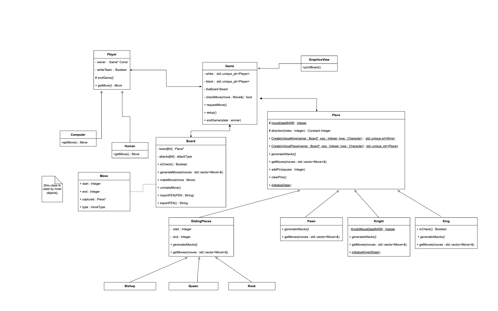

# chess

# Project Overview

<ul> 
  <li> To design and develop a fully functional chess game that can be played by two players </li>  
  <li> To incorporate the standard rules of chess and provide a challenging and enjoyable user experience </li>
  <li> To create an AI opponent for the player to compete against, if desired </li>
  <li> To implement a variety of game modes, such as custom starting positions, and different levels of difficulty for the AI opponent </li>
  <li> To optimize the performance of the game for a seamless experience on different devices and operating systems </li>
  <li> To showcase the ability to design and complete a large-scale software project from start to finish. </li>
  <li> Coordinated with another developer using Git to share work and keep track of changes </li>
  <li> Implemented the ability to import FEN notations to start the game from custom positions and test specific functionalities </li>
  <li> Implemented testing approach by generating all valid moves at different depths and comparing against available online data on number of valid moves at each depth to validate logic </li>
</ul>

# TECH STACK/TOOLS
<ul> 
  <li> C++ </li>
  <li> X11 </li>
  <li> Git </li>
</ul>

# unified modeling language (uml)

